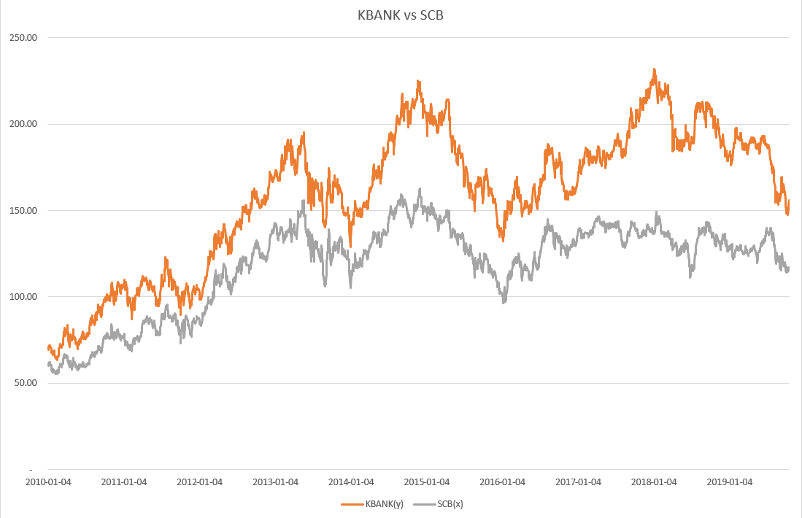
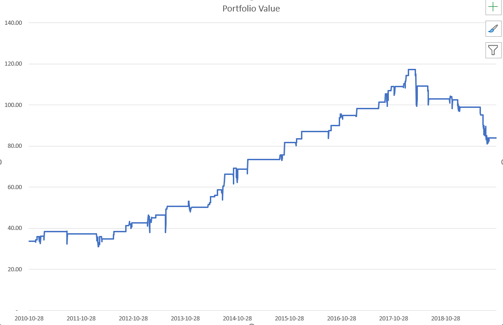

```{r setup, include=FALSE}
knitr::opts_chunk$set(echo = TRUE)
```

## Group  Member (in alphabetical order):  
- Dylan Thorne (dylan.thorne@gmail.com)  
- Pariyat Limpitheeprakan (macchiato.me@gmail.com)    
- Trai Torsricharoen (traitorsricharoen@gmail.com)  
- YIU LEUNG CHENG (howard.yl.cheng.hk@gmail.com)  


## 3.3.1 Algorithmic Trading
### Introduction
To design our own algorithmic trading strategy in R. We decided our selections in this task as follows:

**Number of assets in the strategy**: SPY (Source:[Yahoo](https://finance.yahoo.com/quote/SPY))  
**Type of asset**: stock  
**Timeframe**: from `2007-03-01` to `2017-03-01`  
**Coding language**: R, Excel (used supplmentarily for our analysis)  
**Model**: Neural Networks (Package: [nnet](https://cran.r-project.org/web/packages/nnet/nnet.pdf)).  

Forecasting stock prices has been a daunting task for many of the researchers and analysts. Thanks to recent breakthroughs of deep learning, applications such as deep neural network (Palaniappan, 2018), LSTM (Choudhury, 2019), or even GAN (Zhang, Zhong, Dong, Wang, & Wang, 2019) have been adopted into predicting future stock price in real-time manners. Therefore, we aim to try imitate such application. Our main idea in this project is to simply use neural network model to forcast the direction of stock price. 

Our algorithmic trading implementation are described step-by-step as follow:

### Load input time series data, 

Firstly, we found following package useful in our implmementation:
```{r echo=T, results='hide',message=FALSE}
require("quantmod") # useful quantitative financial modelling and trading framework in R
require(zoo) # for faciliating dealing with time series data
require(dplyr) # for faciliating data transformation
require(nnet) # for NN model
require(caret) # for misc statistics and fundamental machine learning model.
require(ggfortify) # for data visualization
require(magrittr) # for piping %>%
require(PerformanceAnalytics) # for calulate annual return and cummulative return
```
Then we load `SPY` from Yahoo Finance and preview and do some EDA on the time series.
```{r read_input}
options("getSymbols.warning4.0"=FALSE)
invisible(getSymbols("SPY", scr="yahoo",verbose = FALSE))
SPY500<- SPY[,"SPY.Close"]
autoplot(SPY500)
```

### Imputation & Feature Engineering 
We adopted [Last Observation Carried Forward](https://tidsskriftet.no/en/2019/05/medisin-og-tall/last-observation-carried-forward) imputation method by `na.locf` in package [zoo](https://cran.r-project.org/web/packages/zoo/zoo.pdf). Furthermore, we need to extract and derive some features (columns) in order to help our neural networks to learn to encompass variance of the time series. The derived features we chose include: rolling mean, rolling standard deviation, RSI, MACD, Bollinger Bands (used to measure stock's volatility and price levels). For the label of the output of the model, we leverage the lag return and label the output into 3 classes: `NoWhere`, `Up` and `Down`.
```{r}
#fill NA with previous non-NA value

SPY500 <- na.locf(SPY500)
return <- Delt(SPY500)

average10<- rollapply(SPY500, 10, mean)
average20<-rollapply(SPY500, 20, mean)

std10<- rollapply(SPY500, 10, sd)
std20<- rollapply(SPY500, 20, sd)

rsi5<- RSI(SPY500,5,"SMA")
rsi14<- RSI(SPY500, 14, "SMA") 

macd12269<- MACD(SPY500, 12, 26, 9, "SMA")
macd7205<- MACD(SPY500, 7, 20, 5, "SMA")

bollinger_bands<-BBands(SPY500,20,"SMA",2)

direction<- data.frame(matrix(NA,dim(SPY500)[1],1))

lagreturn<- (SPY500 - Lag(SPY500, 20))/Lag(SPY500, 20)

# Feature Engineer the label (multi-class classification)
direction[lagreturn>0.02] <- "Up"
direction[lagreturn< -0.02] <- "Down"
direction[lagreturn< 0.02 &lagreturn> -0.02] <- "NoWhere"

SPY500 <- cbind(SPY500, average10, average20, std10, std20, rsi5, rsi14, macd12269, macd7205, bollinger_bands)
```

### Split Train-Test-Validate Dataset
Next, we split train, test, validate dataset. Notice that we simply divide time series data into train, test and validate dataset by year similar to cross-validation method ("Cross-Validation strategies for Time Series forecasting [Tutorial]," 2019). More importantly, we need to normalize the train, test and validate dataset as well.

```{r}
train_sdate<- "2007-03-01"
train_edate<- "2017-03-01"
vali_sdate<- "2017-03-02"
vali_edate<- "2018-03-02"
test_sdate<- "2018-03-03"
test_edate<- "2019-10-18"
trainrow<- which(index(SPY500) >= train_sdate& index(SPY500) <= train_edate)
valirow<- which(index(SPY500) >= vali_sdate& index(SPY500) <= vali_edate)
testrow<- which(index(SPY500) >= test_sdate& index(SPY500) <= test_edate)
train<- SPY500[trainrow,]
vali<- SPY500[valirow,]
test<- SPY500[testrow,]
trainme<-apply(train,2,mean)
trainstd<-apply(train,2,sd)
trainidn<- (matrix(1,dim(train)[1],dim(train)[2]))
valiidn<- (matrix(1,dim(vali)[1],dim(vali)[2]))
testidn<- (matrix(1,dim(test)[1],dim(test)[2]))
norm_train<- (train-t(trainme*t(trainidn)))/t(trainstd*t(trainidn))
norm_vali<- (vali-t(trainme*t(valiidn)))/t(trainstd*t(valiidn))
norm_test<- (test-t(trainme*t(testidn)))/t(trainstd*t(testidn))
traindir<- direction[trainrow,1]
validir<- direction[valirow,1]
testdir<- direction[testrow,1]
```

### Train our neural network model
As we tuned the parameters, we found that we use 4 hidden layers and use default least-squares cross entropy function to calculate errors. Due to limitations of [Rstudio Cloud](https://rstudio.cloud/), we limit max iteration to 100 iterations to train the model.

```{r}
set.seed(1)
neural_network<- nnet(norm_train, class.ind(traindir), size=4, trace=T)
dim(norm_train)
```

### Evaluate our model with validate and test dataset
To measure performance of our neural network model, we utilize confusion matrix to view model's accuracy, sensitivity, specificity, etc. See more detailed explaination about how to use these metric to evaluate predictive models in ("Measures of Predictive Models: Sensitivity and Specificity," 2018).                  
```{r}
vali_pred<-predict(neural_network, norm_vali)
head(vali_pred)
vali_pred_class<- data.frame(matrix(NA,dim(vali_pred)[1],1))
vali_pred_class[vali_pred[,"Down"] > 0.5,1]<- "Down"
vali_pred_class[vali_pred[,"NoWhere"] > 0.5,1]<- "NoWhere"
vali_pred_class[vali_pred[,"Up"] > 0.5,1]<- "Up"
vali_pred_class[is.na(vali_pred_class)]<- "NoWhere"

u<- union(vali_pred_class[,1],validir)
t<-table(factor(vali_pred_class[,1],u),factor(validir,u))
confusionMatrix(t)
```
```{r}
test_pred<- predict(neural_network, norm_test)
head(test_pred)
test_pred_class<- data.frame(matrix(NA,dim(test_pred)[1],1))
test_pred_class[test_pred[,"Down"] > 0.5,1]<- "Down"
test_pred_class[test_pred[,"NoWhere"] > 0.5,1]<- "NoWhere"
test_pred_class[test_pred[,"Up"] > 0.5,1]<- "Up"
test_pred_class[is.na(test_pred_class)]<- "NoWhere"
u<- union(test_pred_class[,1],testdir)
t<-table(factor(test_pred_class[,1],u),factor(testdir,u))
confusionMatrix(t)
```

As results shown above, accuracy of our model on validate and test dataset is quite high and statiscally significant. 

### Calculate returns, cumulative returns, standard deviation and forecasts
Now, we use predicted return from our model to calculate returns, cumulative returns, standard deviation (Sharpe Ratio of Return over StdDev).

```{r}
signal<-ifelse(test_pred_class=="Up",1,ifelse(test_pred_class=="Down",-1, 0))
test_return_SPY<- return[(index(return)>= test_sdate & index(return)<= test_edate), ]
test_return<- test_return_SPY*(signal)

#calculate cummulative return
cumm_return<- Return.cumulative(test_return)
cumm_return
```
```{r}
#calculate annual return
annual_return<- Return.annualized(test_return)
annual_return
```
```{r}
charts.PerformanceSummary(test_return)
```
```{r}
VaR(test_return, p=0.95)
SharpeRatio(as.ts(test_return), Rf = 0, p=0.95, FUN = "StdDev")
SharpeRatio.annualized(test_return, Rf=0)
```

# 3.3.2 Improve The Strategy  
### Implment Pair trading and Back-Testing in Excel
To improve the trading strategy, we revisit to do EDA (exploratory data analysis) and try to relate to toos and methodology stated in our contents in Econometrics course so that we could find something useful to improve our existing trading strategy. Firstly, we have tried implementing pair trading and backtesting by using Thai Stocks in Banking Sector, namely [KBank](https://finance.yahoo.com/quote/KBANK.BK/) and [SCB](https://finance.yahoo.com/quote/scb.bk/)  (both of which are sourced from Yahoo Finance).

Pair trading is a streatgy for trading two higly correlated financial asset. Its main idea is that sometime the spread between two correlated asset is wider/narrower than usual. Then, trading opportunity exist. Back testing, however, is the test to check that the streatgy work well by test with the historical data. Our findings are as follows






Please refer to more details about our implementation in [PairTrading.xlsx](PairTrading.xlsx). Note that in the excel file, we implement [IFS](https://support.office.com/en-us/article/ifs-function-36329a26-37b2-467c-972b-4a39bd951d45) function inside.

Thanks to our research attempt above, we notice that to the stock price of `SPY` have been time oto time affected by several macro-economics unknown factors. To materialize and factor in such factors, we came up with an idea to incorporate data from [Google trend](https://trends.google.com/trends/) which is, from our point of views, considered as a comprephensive output of those unknown factors. Initiated by this idea, we decided to improve our existing algorithmic trading strategy in [Section 3.3.1] by implmenting **Neural Network model incorporate with GARCH model and Google trend input**.
 
### Implement Neural Network model incorporate with GARCH model and Google trend input

To start with, we have done some literature review: GARCH models and neural network has been adopted to forecast volatility (Lu, Que, & Cao, 2016 ) and conditional variance of stock returns (Arnerić, Poklepović, & Aljinović, 2014). For our this implementation, along with methodology stated in the aforementioned literature, we utilize combinative methods such as ACF plot, PDF plot, qq-plot and associated testing to determine parameters of our GARCH models. 

Our implmentations are as follows. Since R script below are similar to our implmentation in  [Section 3.3.1](#3_3_1), additionally required explanation will be provided: 

```{r echo=T, results='hide',message=FALSE}
require(stats) # for Garch model
require(tseries) # for Garch model
require(forecast) # for Garch model
require(fGarch) # for Garch model
require("rugarch") # for Garch model
```
```{r}
getSymbols("SPY", scr="yahoo",from = as.Date("2007-01-04"), to = as.Date("2019-10-18"),warnings=FALSE)
SPY500<- SPY[,"SPY.Close"]
head(SPY500)
```
```{r}
#Imputation
#fill NA with previous non-NA value
SPY500 <- na.locf(SPY500)
return <- Delt(SPY500)
rows = nrow(return)
return <- return[2:rows]
plot(return)
```
```{r}
#Feature Engineering
#technical analysis indicators
average10<- rollapply(SPY500, 10, mean)
average20<-rollapply(SPY500, 20, mean)
std10<- rollapply(SPY500, 10, sd)
std20<- rollapply(SPY500, 20, sd)
rsi5<- RSI(SPY500,5,"SMA")
rsi14<- RSI(SPY500, 14, "SMA") 
macd12269<- MACD(SPY500, 12, 26, 9, "SMA")
macd7205<- MACD(SPY500, 7, 20, 5, "SMA")
bollinger_bands<-BBands(SPY500,20,"SMA",2)
direction<- data.frame(matrix(NA,dim(SPY500)[1],1))
lagreturn<- (SPY500 - Lag(SPY500, 20))/Lag(SPY500, 20)
direction[lagreturn>0.02] <- "Up"
direction[lagreturn< -0.02] <- "Down"
direction[lagreturn< 0.02 &lagreturn> -0.02] <- "NoWhere"
```
Now, in this step, we begin determining parameters of our GARCH model.
```{r}
#GARCH Model

#adf test suggesting stationarity
adf.test(return)
```
Firstly, we use ADF to test and found `return` is stationary. Next, we plot both PACF and ACF.
```{r}
#PACF plot suggests significant spike through lag 2.
pacf(return)
```
```{r}
#ACF plot shows exponential decay. Thus, it can be deduced AR(2) model.
acf(return)
```
Now we try with ARIMA(2,0,0) and determin square residuals:
```{r}
lengthOfReturns<-length(return)
timeseries <- ts(return)
ARIMA_Model <- arima(window(timeseries,1,lengthOfReturns), order=c(2,0,0), method = "ML")
```
```{r}
acf((ARIMA_Model$residuals)^2)
```
```{r}
pacf((ARIMA_Model$residuals)^2)
```
Finally, we try fitting model with  ARMA(2,0) and GARCH(11,0)
```{r}
model <- garchFit(formula = ~ arma(2,0) + garch(11,0) , data = timeseries, trace = F)
summary(model)
res = residuals(model)
```
And then we plot qq-plot of residual between GARCH model and actual data: 
```{r}
qqnorm(res)
```
```{r}
garch11_spec <- ugarchspec(variance.model = list(garchOrder = c(11, 0)),mean.model = list(armaOrder = c(2, 0)))
garch11_fit<-ugarchfit(spec=garch11_spec,solver.control = list(tol = 1e-12), data=timeseries)
garch11_fit
garch11_fit@fit$fitted.values
```
Now we visualize how well GARCH itself fit the data:
```{r}
plot(timeseries, type="l", col="blue")
lines(garch11_fit@fit$fitted.values, col="green")
```
Here, after we fitting the GARCH model, the output is applied with rolling window function and combine into input dataset for training in neural network model.
```{r}
#binding closing price and technical analysis indicators into a variable SPY500
SPY500 <- cbind(SPY500[2:nrow(SPY500)], average10[2:nrow(average10)], average20[2:nrow(average20)], std10[2:nrow(std10)], std20[2:nrow(std20)], rsi5[2:nrow(rsi5)], rsi14[2:nrow(rsi14)], macd12269[2:nrow(macd12269)], macd7205[2:nrow(macd7205)], bollinger_bands[2:nrow(bollinger_bands)])

#integrate GARCH model rolling window prediction output into variable 
SPY500 <- cbind(SPY500,garch11_fit@fit$fitted.values)
```

In this step, we incoporate Google Trend data into our GARCH model. Google trend data is extracted from Google Trend website. Yet, the data retrieved from there is in monthly basis. So, we just transformed those data into daily basis with excel:
- [Recession_gtrends.csv](Recession_gtrends.csv)  
- [Expansion_gtrends.csv](Expansion_gtrends.csv)  

We combine existing input data and newly read Google Trend data:
```{r}
#Import Google trend data regarding trend of recession and expansion
recessiondata<-read.csv("Recession_gtrends.csv",header=F)$V2
expansiondata<-read.csv("Expansion_gtrends.csv",header=F)$V2
#integrate Google trend data into variable
SPY500 <- cbind(SPY500,recessiondata,expansiondata)
```
And then we begin the same process as int
```{r}
#indicate end and start dates for train, validating and testing period
train_sdate<- "2007-03-01"
train_edate<- "2017-03-01"
vali_sdate<- "2017-03-02"
vali_edate<- "2018-03-02"
test_sdate<- "2018-03-03"
test_edate<- "2019-10-18"
```
```{r}
#constructing data ranges for the three datasets
trainrow<- which(index(SPY500) >= train_sdate& index(SPY500) <= train_edate)
valirow<- which(index(SPY500) >= vali_sdate& index(SPY500) <= vali_edate)
testrow<- which(index(SPY500) >= test_sdate& index(SPY500) <= test_edate)
```
```{r}
#extract data fpr training, validating and testing periods
train<- SPY500[trainrow,]
vali<- SPY500[valirow,]
test<- SPY500[testrow,]
trainme<-apply(train,2,mean)
trainstd<-apply(train,2,sd)

#training, validating and testing data dimensions
trainidn<- (matrix(1,dim(train)[1],dim(train)[2]))
valiidn<- (matrix(1,dim(vali)[1],dim(vali)[2]))
testidn<- (matrix(1,dim(test)[1],dim(test)[2]))

#normalize the three datasets
norm_train<- (train-t(trainme*t(trainidn)))/t(trainstd*t(trainidn))
norm_vali<- (vali-t(trainme*t(valiidn)))/t(trainstd*t(valiidn))
norm_test<- (test-t(trainme*t(testidn)))/t(trainstd*t(testidn))

#define training, validating and testing period
traindir<- direction[trainrow,1]
validir<- direction[valirow,1]
testdir<- direction[testrow,1]
```
Additionally, we improve our neural network by hyper-parameter tuning (Boyle, 2019), i.e. increase iterations and lower hidden layers and set weight decay in order to mitigate overfitting.
```{r}
#implement NN
require(nnet)
set.seed(1)
neural_network<- nnet(norm_train, class.ind(traindir), maxit = 400, size=2,decay=0.01, trace=T)

```
```{r}
#obtain data dimension
dim(norm_train)

#make prediction
vali_pred<-predict(neural_network, norm_vali)
head(vali_pred)

#calculate the predicted direction using the information obtained above
vali_pred_class<- data.frame(matrix(NA,dim(vali_pred)[1],1))
vali_pred_class[vali_pred[,"Down"] > 0.5,1]<- "Down"
vali_pred_class[vali_pred[,"NoWhere"] > 0.5,1]<- "NoWhere"
vali_pred_class[vali_pred[,"Up"] > 0.5,1]<- "Up"
vali_pred_class[is.na(vali_pred_class)]<- "NoWhere"

#check forecast accuracy

u<- union(vali_pred_class[,1],validir)
t<-table(factor(vali_pred_class[,1],u),factor(validir,u))
confusionMatrix(t)

#check accuracy on testing data
test_pred<- predict(neural_network, norm_test)
head(test_pred)

#indicate the classes for the testing data
test_pred_class<- data.frame(matrix(NA,dim(test_pred)[1],1))
test_pred_class[test_pred[,"Down"] > 0.5,1]<- "Down"
test_pred_class[test_pred[,"NoWhere"] > 0.5,1]<- "NoWhere"
test_pred_class[test_pred[,"Up"] > 0.5,1]<- "Up"
test_pred_class[is.na(test_pred_class)]<- "NoWhere"
```
```{r}
#Check the accuracy of the forecasts
u<- union(test_pred_class[,1],testdir)
t<-table(factor(test_pred_class[,1],u),factor(testdir,u))
confusionMatrix(t)
```
```{r}
#generate trade signals using the same pattern as human psychology
signal<-ifelse(test_pred_class=="Up",1,ifelse(test_pred_class=="Down",-1, 0))

test_return_SPY<- return[(index(return)>= test_sdate & index(return)<= test_edate), ]
test_return<- test_return_SPY*(signal)
```
```{r}
#calculate cummulative return
cumm_return<- Return.cumulative(test_return)
cumm_return

#calculate annual return
annual_return<- Return.annualized(test_return)
annual_return
charts.PerformanceSummary(test_return)
VaR(test_return, p=0.95)
SharpeRatio(as.ts(test_return), Rf = 0, p=0.95, FUN = "StdDev")
SharpeRatio.annualized(test_return, Rf=0)
```

### Conclusion
In this group work project, adopted methodologies from several articles, we have implemented algorithmic trading strategy based upon neural network predictive model. Upon including, Google Trend data and GARCH model, we also devise a new neural network model. As the new neural model's performance shown, although the new neural network model does notsignificantly outperform the former model in terms of accuracy, sensitivity and specificity, the new model prediction can produce stable returns as it gives lower standard deviation of Sharpe ratio. Apart from that, this implementation proves that we can incoporate several techniques from traditional time-series technical anaysis and advanced machine learning techniques into practical use for predictive model development.

### Future Work
Our group would like to try adapt a methodology used to  predict power usage by LSTM ("How to Develop Multi-Step LSTM Time Series Forecasting Models for Power Usage," 2019) into our use case scenario in this project.


# References
Palaniappan, V. (2018, November 21). Neural Networks to Predict the Market. Retrieved from https://towardsdatascience.com/neural-networks-to-predict-the-market-c4861b649371

Choudhury, A. (2019, May 6). Stock Market Prediction by Recurrent Neural Network on LSTM Model. Retrieved from https://blog.usejournal.com/stock-market-prediction-by-recurrent-neural-network-on-lstm-model-56de700bff68

Zhang, K., Zhong, G., Dong, J., Wang, S., & Wang, Y. (2019). Stock Market Prediction Based on Generative Adversarial Network. Procedia Computer Science, 147, 400-406. doi:10.1016/j.procs.2019.01.256

Cross-Validation strategies for Time Series forecasting [Tutorial]. (2019, May 6). Retrieved from https://hub.packtpub.com/cross-validation-strategies-for-time-series-forecasting-tutorial/

Measures of Predictive Models: Sensitivity and Specificity. (2018, January 5). Retrieved from https://www.theanalysisfactor.com/sensitivity-and-specificity/

Arnerić, J., Poklepović, T., & Aljinović, Z. (2014). GARCH based artificial neural networks in forecasting conditional variance of stock returns. Croatian Operational Research Review, 5(2), 329-343. doi:10.17535/crorr.2014.0017

Lu, X., Que, D., & Cao, G. (2016). Volatility Forecast Based on the Hybrid Artificial Neural Network and GARCH-type Models. Procedia Computer Science, 91, 1044-1049. doi:10.1016/j.procs.2016.07.145

Boyle, T. (2019, February 16). Hyperparameter Tuning. Retrieved from https://towardsdatascience.com/hyperparameter-tuning-c5619e7e6624

How to Develop Multi-Step LSTM Time Series Forecasting Models for Power Usage. (2019, August 5). Retrieved from https://machinelearningmastery.com/how-to-develop-lstm-models-for-multi-step-time-series-forecasting-of-household-power-consumption/
